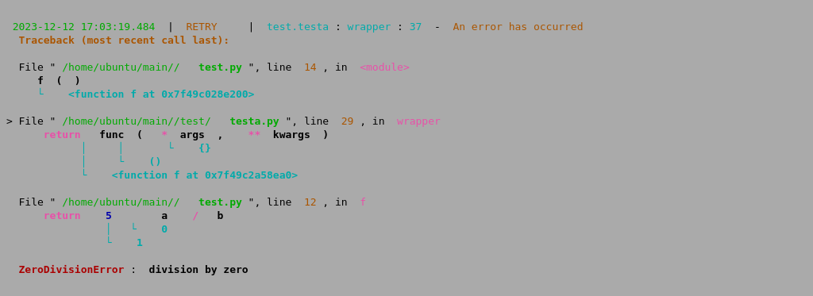

# Features

The purpose of the project is to capture exceptions that occur within Python scripts and to notify oneself in a timely manner.

Common methods of exception logging each have their drawbacks:

Logging exceptions to a file can lack immediacy.
Sending them directly to one's phone can be insufficiently detailed or unreadable.
Therefore, this project involves capturing exceptions as screenshots and then sending them to an email address, ensuring that the exception messages are readable while also guaranteeing prompt receipt of the message.

Additionally, the processes of taking screenshots and sending emails are separated into two independent interfaces that can be used individually.

Implementation pathway:

exception -> ansi -> html -> img -> mail

Capture the exception, convert it into an image, and finally send it to oneself via email.

项目的目的是捕获python脚本中出现的异常并及时通知自己，

常用的异常记录方式都有一定弊端：
1. 异常记录到日志会不够及时
2. 直接发送到自己手机就不够详细或者不可读
   
所以本项目将捕获的异常截屏再发送到邮箱，既能保证异常消息可读，也能保证消息及时收到。

并且将截图和发送邮件拆分成两个接口可以独立使用。

实现途径：

exception -> ansi -> html -> img -> mail

捕获异常，然后转为图片，最后通过邮件发送给自己

# Usage



```python
from loguru import logger
import requests
mail_address = '<your mail address>'
def send_exception(ansi_str: str):
    url = 'http://api.liuhetian.work/v1'
    img_path = requests.post(f'{url}/ansi2img', json={'ansi_string': ansi_str}).json()
    requests.post(f'{url}/sendmail', json={'to': mail_address, 'title': 'test', 'contents': f''})
logger.add(send_exception, colorize=True)


@logger.catch
def main():
    # your code, auto delivery exception to your mail
    a, b = 1, 0
    a / b

if __name__ == '__main__':
    main()
```

# Installation

I have provided a server, and the service can be used directly without the need to install my code. However, if you want to use loguru, you still need to 

我提供了服务器，服务可以直接使用，无需安装我的代码，但如果要使用loguru仍然需要`pip install loguru`

```python
pip install loguru.
```

If you want to deploy on your own server, you will need:
如果想部署在自己的服务器需要：

```bash
sudo apt-get update
sudo apt-get install wkhtmltopdf
pip install ansi2html imgkit boto3 fastapi uvicorn python-dotenv yagmail markdown

git clone git@github.com:liuhetian/ansi2img.git
vi .secrets  # 写密码
uvicorn main:app --reload --host 0.0.0.0 --port 80
```

## 功能

有两个独立的功能：

功能1. ansi2img
把报错转为图像地址，可以继续发送给钉钉(微信 QQ没试过)

功能2. 发送邮件


### 生成图像效果


```python
import requests
a = '''
 \x1b[32m2023-12-12 17:03:19.484 \x1b[0m |  \x1b[33mRETRY    \x1b[0m |  \x1b[36mtest.testa \x1b[0m: \x1b[36mwrapper \x1b[0m: \x1b[36m37 \x1b[0m -  \x1b[33mAn error has occurred \x1b[0m
 \x1b[33m \x1b[1mTraceback (most recent call last): \x1b[0m

  File " \x1b[32m/home/ubuntu/main/重试并保存错误/ \x1b[0m \x1b[32m \x1b[1mtest.py \x1b[0m", line  \x1b[33m14 \x1b[0m, in  \x1b[35m<module> \x1b[0m
     \x1b[1mf \x1b[0m \x1b[1m( \x1b[0m \x1b[1m) \x1b[0m
     \x1b[36m└  \x1b[0m \x1b[36m \x1b[1m<function f at 0x7f49c028e200> \x1b[0m

> File " \x1b[32m/home/ubuntu/main/重试并保存错误/test/ \x1b[0m \x1b[32m \x1b[1mtesta.py \x1b[0m", line  \x1b[33m29 \x1b[0m, in  \x1b[35mwrapper \x1b[0m
     \x1b[35m \x1b[1mreturn \x1b[0m  \x1b[1mfunc \x1b[0m \x1b[1m( \x1b[0m \x1b[35m \x1b[1m* \x1b[0m \x1b[1margs \x1b[0m \x1b[1m, \x1b[0m  \x1b[35m \x1b[1m** \x1b[0m \x1b[1mkwargs \x1b[0m \x1b[1m) \x1b[0m
     \x1b[36m       │     │       └  \x1b[0m \x1b[36m \x1b[1m{} \x1b[0m
     \x1b[36m       │     └  \x1b[0m \x1b[36m \x1b[1m() \x1b[0m
     \x1b[36m       └  \x1b[0m \x1b[36m \x1b[1m<function f at 0x7f49c2a58ea0> \x1b[0m

  File " \x1b[32m/home/ubuntu/main/重试并保存错误/ \x1b[0m \x1b[32m \x1b[1mtest.py \x1b[0m", line  \x1b[33m12 \x1b[0m, in  \x1b[35mf \x1b[0m
     \x1b[35m \x1b[1mreturn \x1b[0m  \x1b[34m \x1b[1m5 \x1b[0m  \x1b[35m \x1b[1m+ \x1b[0m  \x1b[1ma \x1b[0m  \x1b[35m \x1b[1m/ \x1b[0m  \x1b[1mb \x1b[0m
     \x1b[36m           │   └  \x1b[0m \x1b[36m \x1b[1m0 \x1b[0m
     \x1b[36m           └  \x1b[0m \x1b[36m \x1b[1m1 \x1b[0m

 \x1b[31m \x1b[1mZeroDivisionError \x1b[0m: \x1b[1m division by zero \x1b[0m
'''

url = f'http://api.liuhetian.work/v1/ansi2img'
requests.post(url, json={'ansi_string': a}).json()
```

### 发送邮件效果

```python
url = f'http://api.liuhetian.work/v1/sendmail'
data = {
    'to': '<your mail address>',
    'title': 'test',
    'contents': 'Hello world!'
}
requests.post(url, json=data)
```

### todo

- [ ] 图片储存到本地并直接用fastapi提供静态文件服务

```python
from fastapi import FastAPI
from fastapi.staticfiles import StaticFiles

app = FastAPI()

# 将 `./static` 目录挂载为静态文件服务，所有存储在这个目录下的文件都可以通过 '/static' 路径访问
app.mount("/static", StaticFiles(directory="static"), name="static")

```

- [ ] 增加容量报警
